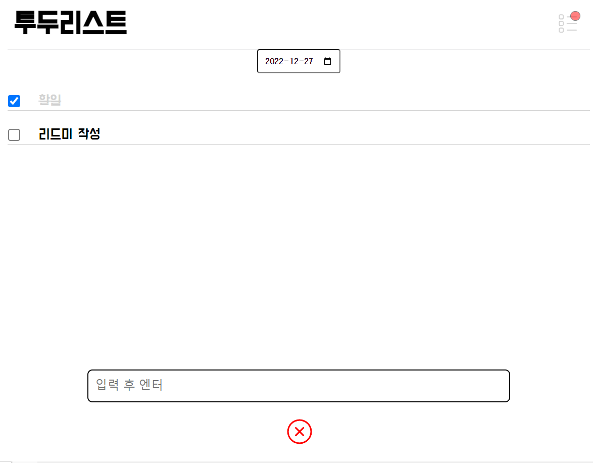

# todolist 앱

날짜별 할 일 체크리스트 관리 앱

 
 

# 데모 보기

> https://cskim9410.github.io/todo-list

 

# 프로젝트 기간

- 2022-12-13 ~ 2022-12-25
   

# 실행 방법

> `npm start` >

# 사용 방법

- 날짜를 선택하여 할 일을 추가합니다.
- 미완료 된 할일이 있으면 우측 상단버튼에 뱃지가 나타납니다.
- 체크 하거나 삭제하여 할 일을 관리하세요!
